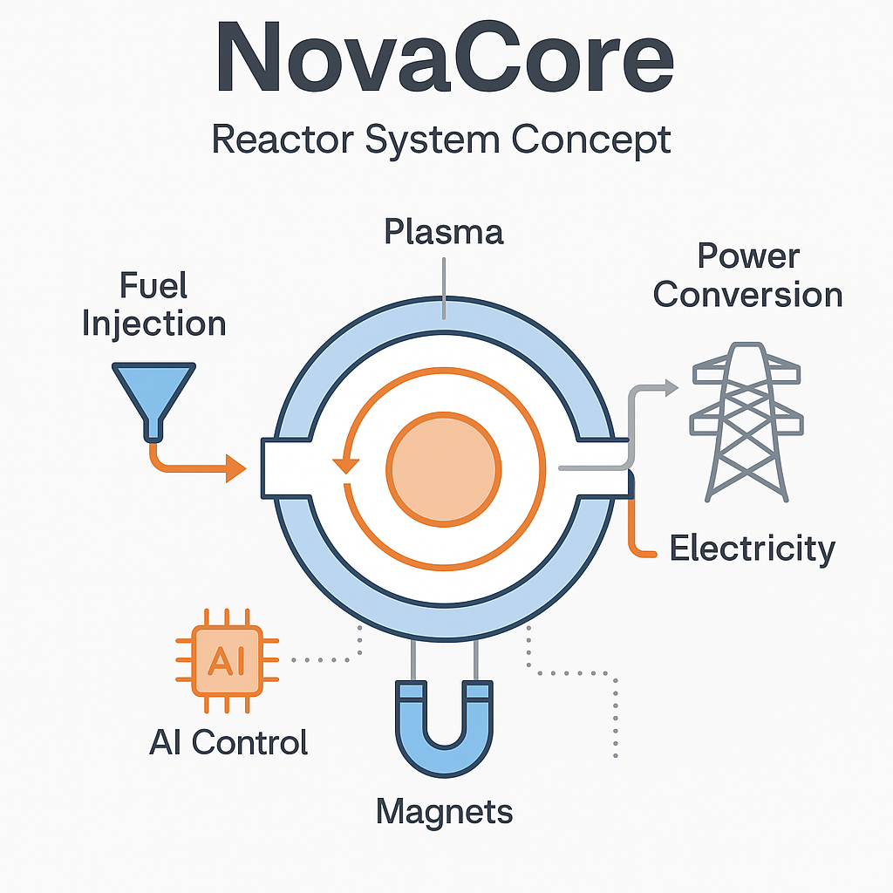
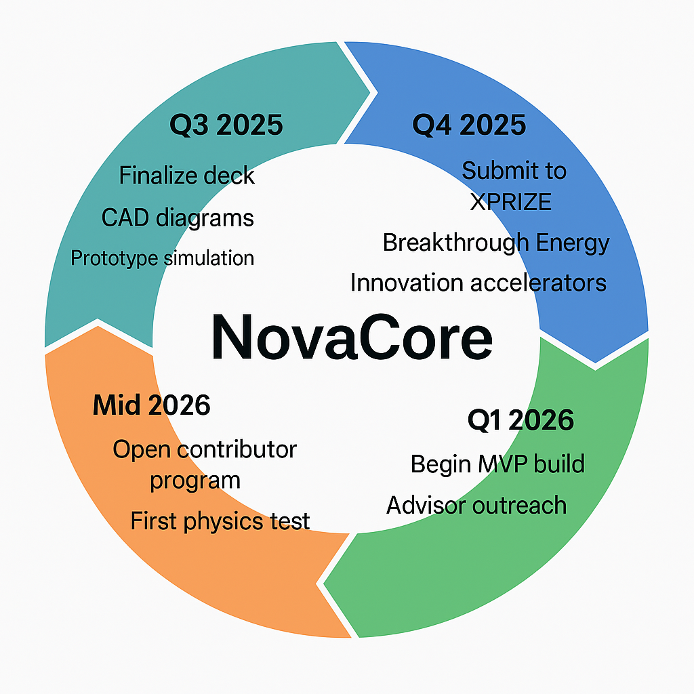

# NovaCore-Project
# 🚀 Project NovaCore: AI-Assisted Micro-Fusion Reactor Concept

## 🌐 Overview
**NovaCore** is a visionary concept for a compact, pulsed micro-fusion reactor designed using the power of AI and data-driven modeling. This project explores the theoretical design of a contained, clean-energy fusion system that draws inspiration from inertial confinement and electromagnetic pulse fusion techniques.

> Created in collaboration with GPT-4, this project combines science, imagination, and advanced AI to tackle global energy problems.

---

## ⚙️ Concept Summary
- **Name:** NovaCore
- **Goal:** Build a compact, clean, and scalable micro-fusion reactor
- **Approach:**
  - Pulsed micro-fusion bursts
  - Containment via electromagnetic or laser trapping
  - Thermal → electrical energy capture via heat exchangers or direct conversion
- **Inspiration:** Iron Man's arc reactor, inertial confinement fusion, tokamaks, Helion Energy

---

## 📄 Deliverables So Far
| Asset | Status |
|-------|--------|
| 📘 Vision Proposal PDF | ✅ Completed |
| 📊 Pitch Deck (PDF) | ✅ Completed |
| 🧠 Concept Diagrams | 🛠 In Progress |
| 🧪 Simulation Path (Python) | 🧭 Exploring |

---

## 🖼️ Visual Pitch Deck
- [NovaCore_Pitch_Deck.pdf](./docs/NovaCore_Pitch_Deck.pdf) – A visual presentation of the concept, strategy, and vision.

---

## 📘 Vision Document
- [NovaCore Proposal (PDF)](./docs/Project_NovaCore_Vision_Proposal.pdf)

---

## 🔭 Technologies Mentioned / Potential Tools
- Python (NumPy, Matplotlib)
- COMSOL Multiphysics or PyFusion for modeling
- GPT-4 for iterative design and planning
- Fusion fuels: Deuterium, Tritium, Boron-11
- Containment: Magnetic coils, laser ignition, pellet injection

---

## 🖼️ Visual Assets

We are building and releasing supporting assets for better understanding and presentation of NovaCore:

- ✅ Title Slide Visual / Logo
- 🌀 Reactor Concept Diagram (
- 🗺️ Timeline Roadmap Graphic (
- 📊 Icons & Infographics for Deck *(Ongoing)*

All assets will be published in `/assets/` or embedded directly in the deck.

---

## 📬 Next Milestones
- [ ] Finalize concept visuals / CAD sketch
- [ ] Complete pitch deck
- [ ] Submit to XPRIZE, Hello Tomorrow, Breakthrough Energy
- [ ] Publish on HuggingFace or Medium

---

## 🤝 Want to Collaborate?
If you’re an energy physicist, AI engineer, or just a dreamer like us — let’s connect! NovaCore is open for collaboration.

> Powered by imagination. Guided by science. Built with AI.

---

## 👨‍💻 Author
**Jarnell Chohan**  
Data Analyst | Visionary Builder | AI + CleanTech Explorer
  
